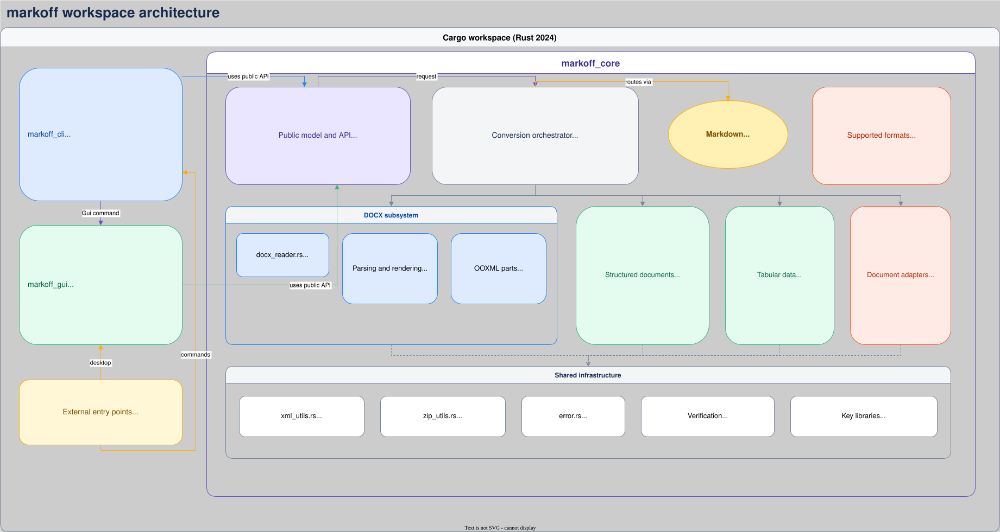

# markoff

[English version](../README.md)

Подробное руководство по использованию готового приложения:
[tutorial/README.ru.md](tutorial/README.ru.md).

markoff — это рабочее пространство Rust для двунаправленного преобразования документов Microsoft Office в Markdown и структурированные форматы данных и обратно. В проекте уже настроены базовая система конвертации, сценарий работы GUI, проверки качества, бенчмарки и конвейер сборки релизов.

## Текущий статус

Проект вышел за пределы начальной заготовки:

- структура рабочего пространства завершена;
- основной crate содержит модель форматов и конвейер конвертации;
- доступны преобразования текста и табличных данных, включая XLSX;
- CLI поддерживает обработку одного файла, пакетное преобразование и работу с текстовыми потоками;
- GUI предоставляет локальную очередь конвертации с предварительным просмотром и поддержкой перетаскивания файлов.

### Реализовано

- рабочее пространство Cargo с тремя crate: `markoff_core`, `markoff_cli` и `markoff_gui`;
- метаданные сборки `vergen 10` в выводе `--version` CLI и в диалоге About GUI;
- CI на GitHub Actions для Windows и Linux: форматирование, Clippy, тесты и релизные сборки;
- общее перечисление `Format` и определение формата по расширению файла;
- проверка запросов на конвертацию и типизированная обработка ошибок;
- преобразование документов Markdown/DOCX/PDF/PPTX/HTML в типизированную
  схему JSON/YAML/TOML и обратно в Markdown/DOCX/PDF/PPTX/HTML; встроенное форматирование, списки, ссылки,
  сноски, параметры блоков кода и ячейки таблиц представлены структурно;
- преобразование значений между JSON, YAML и TOML;
- полноценная конвертация текста:
  - `JSON <-> Markdown`;
  - `CSV <-> Markdown`;
- `Markdown Tables <-> XLSX`, включая книги с несколькими листами, закреплённые строки заголовков и автоматически подогнанную ширину столбцов;
- `JSON / CSV / YAML / TOML <-> XLSX` для массивов объектов и табличных листов;
- `DOCX <-> Markdown` для заголовков, абзацев, таблиц, вложенных маркированных и нумерованных списков, полужирного, курсивного, зачёркнутого и подчёркнутого текста, встроенного и ограждённого кода, цитат, горизонтальных линий, сносок, закладок и ссылок `PAGEREF`;
- `DOCX -> HTML` через Markdown с сохранением поддерживаемых элементов документа;
- `DOCX tables -> CSV / XLSX / JSON / YAML / TOML`, а также `CSV / XLSX -> DOCX`;
- `PDF -> Markdown / JSON / YAML / TOML` для документов со встроенным текстовым слоем, а также `Markdown / DOCX / JSON / YAML / TOML -> PDF`;
- `PPTX <-> Markdown` для заголовков слайдов и основного текста/маркированных списков;
- `HTML <-> Markdown` для заголовков, выделения, ссылок, изображений, списков, цитат, блоков кода и таблиц;
- `PDF / PPTX / HTML -> JSON / YAML / TOML` и обратное преобразование JSON/YAML/TOML в Markdown, DOCX, PDF, PPTX или HTML;
- команда CLI `convert` с текстовым stdin/stdout и команда `batch` с glob-шаблонами и индикаторами прогресса;
- очередь конвертации GUI с выбором файлов, перетаскиванием, выбором целевого формата, темами и предварительным просмотром с учётом формата: отрисованный Markdown, сворачиваемое дерево JSON/YAML/TOML или обычный текст;
- модульные, интеграционные тесты и тесты на основе свойств для основного crate, проверяющие обратное преобразование DOCX и XLSX.

### Пока не реализовано

- повторное встраивание изображений в DOCX при преобразовании из Markdown или структурированных данных;
- расположение фигур PPTX, встроенные изображения/диаграммы и заметки докладчика не сохраняются (обрабатываются только заголовки слайдов и основной текст/маркированные списки).

## План рефакторинга

Чек-лист задач, выявленных при аудите кодовой базы. Отмечайте пункт только после реализации и прохождения регрессионных проверок.

- [ ] Обновить устаревшее ожидание GUI-теста в [`application.rs`](../crates/markoff_gui/src/application.rs): верхнеуровневый блок имеет тип `list`, а не `list_item`; сохранить проверку вложенных элементов списка.
- [ ] Обеспечить очистку временных входных и выходных файлов CLI при любом завершении, включая ошибки конвертации и записи в stdout, в [`main.rs`](../crates/markoff_cli/src/main.rs).
- [ ] Заменить разбор путей изображений по подстрокам на Markdown-aware разбор в [`preview.rs`](../crates/markoff_gui/src/preview.rs); проверить title, экранирование и вложенные скобки.
- [ ] Отличать Windows drive-relative пути, например `C:folder\img.png`, от URI-схем в [`preview.rs`](../crates/markoff_gui/src/preview.rs); проверить относительные и абсолютные пути, а также настоящие URI.
- [ ] Разделить маршрутизацию конвертации в [`lib.rs`](../crates/markoff_core/src/lib.rs) на специализированные помощники, сохранив все пары форматов и режим «только таблицы».
- [ ] Обрабатывать glob-совпадения в пакетной конвертации CLI потоком, а не собирать все пути заранее; сохранить порядок и обработку ошибок.
- [ ] Добавить GUI-тесты успешной и неуспешной генерации предпросмотра, очистки временных файлов и явной обработки ошибок.

Текущее состояние: `cargo test --workspace --all-targets` падает в `keeps_all_document_blocks_by_default_in_gui`: проверка ожидает `list_item`, тогда как реализация возвращает `list`.

## Архитектура



Откройте [встроенную SVG-диаграмму](architecture/markoff-architecture.drawio.svg) непосредственно в расширении Draw.io Integration или на сайте [diagrams.net](https://app.diagrams.net/). SVG сохраняет редактируемые данные draw.io для обеих страниц: **Architecture** показывает зависимости crate и модулей, а **Repository layout** — полную структуру рабочего пространства, ресурсы сборки, тесты и документацию.

## Быстрый старт

Установите актуальный стабильный [toolchain Rust](https://www.rust-lang.org/tools/install), клонируйте репозиторий и соберите рабочее пространство из его корня:

```powershell
cargo build --workspace
```

Перед использованием локально собранной версии запустите набор тестов:

```powershell
cargo test --workspace
```

В следующих примерах для разработки используется `cargo run`. Релизная сборка создаётся командой `cargo build --release`; исполняемый файл будет находиться в `target/release/markoff_cli` (или `markoff_cli.exe` в Windows).

Для чтения и создания PDF используется `pdfium-render`. Соответствующая нативная библиотека Pdfium загружается и встраивается во время сборки, увеличивая размер каждого бинарного файла приложения примерно на 30 МБ. При первом преобразовании PDF она извлекается в кэш пользователя; во время выполнения сетевой доступ и отдельно установленная библиотека Pdfium не требуются. PDF-файлы создаются со встроенным шрифтом, поддерживающим кириллицу, и автоматически перевёрстанным текстом.

### Использование исполняемого файла

Чтобы использовать приложение без `cargo run`, один раз соберите релизный бинарный файл:

```powershell
cargo build --release -p markoff_cli
```

В PowerShell запускайте исполняемый файл из корня репозитория, используя относительный путь:

```powershell
.\target\release\markoff_cli.exe --help
.\target\release\markoff_cli.exe --version
.\target\release\markoff_cli.exe convert .\report.csv --to md
```

Чтобы вызывать `markoff_cli.exe` из любого каталога, скопируйте его в каталог, уже указанный в переменной окружения `PATH`, или добавьте `target\release` в `PATH` текущей сессии PowerShell:

```powershell
$env:Path += ";$PWD\target\release"
markoff_cli.exe convert .\report.csv --to md
```

В Linux и macOS используйте `./target/release/markoff_cli`. В следующих разделах показана форма команд для разработки с `cargo run`; замените `cargo run -p markoff_cli --` путём к исполняемому файлу, чтобы запускать те же команды из собранного приложения.

## Командная строка

Показать список команд и поддерживаемых аргументов:

```powershell
cargo run -p markoff_cli -- --help
cargo run -p markoff_cli -- convert --help
cargo run -p markoff_cli -- --version
```

### Преобразование одного файла

Общий вид команды:

```text
markoff convert INPUT [--from FORMAT] [--to FORMAT] [-o OUTPUT]
```

Исходный формат определяется по расширению входного файла, а целевой — аргументом `--to` или расширением выходного файла. Используйте `--from`, если исходный формат нельзя определить автоматически. Если `-o` не указан, преобразованный файл записывается рядом с исходным с целевым расширением. Если файл назначения уже существует, команда завершается с ошибкой, если не передан параметр `--overwrite`.

```powershell
# CSV в таблицу Markdown; создаёт .\report.md
cargo run -p markoff_cli -- convert .\report.csv --to md

# Markdown в DOCX с явно заданным путём вывода
cargo run -p markoff_cli -- convert .\notes.md -o .\output\notes.docx

# DOCX в Markdown
cargo run -p markoff_cli -- convert .\report.docx --to markdown

# PDF в Markdown
cargo run -p markoff_cli -- convert .\report.pdf --to markdown

# Таблица Markdown в книгу XLSX
cargo run -p markoff_cli -- convert .\scores.md -o .\scores.xlsx

# Массив объектов JSON в XLSX
cargo run -p markoff_cli -- convert .\people.json --to xlsx

# XLSX в JSON
cargo run -p markoff_cli -- convert .\people.xlsx -o .\people.json

# Перезаписать существующий выходной файл
cargo run -p markoff_cli -- convert .\report.csv --to md --overwrite

# CSV с разделителем-точкой с запятой
cargo run -p markoff_cli -- convert .\report.csv --to md --delimiter ';'

# Значения, разделённые табуляцией
cargo run -p markoff_cli -- convert .\report.csv --to md --delimiter tab
```

Поддерживаемые идентификаторы форматов: `docx`, `pdf`, `md`/`markdown`, `xlsx`/`xlsm`, `json`, `csv`, `yaml`/`yml`, `toml`, `pptx` и `html`/`htm`. PDF со встроенным текстовым слоем можно преобразовать в Markdown или JSON/YAML/TOML; PDF можно создавать из Markdown, DOCX и JSON/YAML/TOML. PDF-экспорт сохраняет поддерживаемую структуру и форматирование, таблицы, код, ссылки, сноски и растровые изображения PNG/JPEG/GIF/BMP/WebP; заголовки доступны в панели оглавления PDF, ссылки на разделы и HTTP(S)/mailto/tel кликабельны. Содержимое автоматически размещается на страницах A4, поэтому исходные разрывы страниц и точная позиционная вёрстка не сохраняются. Другие URI-схемы выводятся как текст; SVG-изображения и OCR отсканированных PDF пока не поддерживаются. Конвертация PPTX охватывает только заголовки слайдов и основной текст/маркированные списки (расположение фигур, изображения, диаграммы и заметки докладчика не сохраняются).

`--delimiter` задаёт разделитель полей CSV (один символ или слово `tab`); по умолчанию используется запятая. Параметр применяется везде, где CSV читается или записывается (`convert` и `batch`, включая промежуточные форматы XLSX/DOCX).

### Стандартный ввод и вывод

Используйте `-` как путь к входному файлу, чтобы читать из стандартного ввода, и как путь к выходному файлу, чтобы писать в стандартный вывод. Оба конца цепочки должны использовать текстовые форматы: Markdown, JSON, CSV, YAML или TOML. Если ни одно имя файла не позволяет определить форматы, укажите оба явно.

```powershell
'{"name":"Ada","active":true}' | cargo run -p markoff_cli -- convert - --from json --to markdown -o -

Get-Content .\table.csv | cargo run -p markoff_cli -- convert - --from csv --to md -o -
```

Двоичные файлы Office (`.docx`, `.xlsx`, `.xlsm`) нельзя читать из stdin или записывать в stdout.

### Пакетное преобразование

Преобразовать все совпадающие файлы в каталоге. При необходимости конвертер создаёт каталог вывода:

```powershell
# Преобразовать все DOCX из .\documents в Markdown-файлы в .\converted
cargo run -p markoff_cli -- batch .\documents --pattern '*.docx' --to md -o .\converted

# Преобразовать CSV в книги XLSX
cargo run -p markoff_cli -- batch .\exports --pattern '*.csv' --to xlsx -o .\workbooks
```

Как и для `convert`, передайте `--overwrite`, чтобы заменить уже существующие выходные файлы; иначе совпавший существующий файл назначения остановит пакетную операцию с ошибкой. Входной файл нельзя перезаписать даже с `--overwrite`.

Шаблон интерпретируется относительно переданного каталога. Индикатор прогресса показывает обработанные файлы; преобразование останавливается и возвращает ошибку, если совпавший файл недоступен либо отдельный входной файл не поддерживается или некорректен.

## Графическое приложение

Запустите GUI напрямую во время разработки или через команду CLI:

```powershell
cargo run -p markoff_gui
cargo run -p markoff_cli -- gui
```

1. Нажмите **Add files** или перетащите файлы в окно приложения.
2. Выберите нужный целевой формат в поле **Convert to**.
3. Имена выходных файлов в очереди обновляются автоматически при смене целевого формата.
4. Выберите файл в очереди и нажмите **Convert selected**.
5. Просмотрите исходный документ и результат. Преобразованный файл сохраняется рядом с исходным с выбранным целевым расширением.

Для поддерживаемых пар «документ ↔ JSON/YAML/TOML» в панели доступен
переключатель **Tables only**. Панель также переключает тёмную и светлую темы
и открывает информацию о сборке в разделе **About**. Файлы преобразуются по
одному для выбранной записи очереди; повторное добавление того же пути не
создаёт дубликат задания.

## Поведение форматов и ограничения

- DOCX и Markdown сохраняют заголовки, абзацы, вложенные нумерованные и маркированные списки, таблицы, полужирный, курсивный, зачёркнутый и подчёркнутый текст, встроенные и ограждённые блоки кода, цитаты, горизонтальные линии, сноски, закладки и ссылки `PAGEREF`. Структурированные JSON/YAML/TOML также сохраняют встроенное форматирование, номера списков, выравнивание таблиц и строку параметров ограждённого блока кода.
- При преобразовании PDF в Markdown, JSON, YAML или TOML текстовый слой извлекается с помощью Pdfium, а встроенные растровые изображения — с помощью `lopdf` (они сохраняются рядом с Markdown или встраиваются в структурированный результат). Разметка страницы, векторная графика, таблицы и отсканированный текст не сохраняются; изображения добавляются после текста, а не на исходные позиции.
- При создании PDF из Markdown, DOCX или JSON/YAML/TOML сохраняются поддерживаемые inline-стили, заголовки, вложенные списки, таблицы с выравниванием, кодовые блоки, цитаты, сноски, закладки, ссылки и растровые изображения PNG/JPEG/GIF/BMP/WebP. Длинные строки кода переносятся внутри подложки блока, в том числе при переходе на следующую страницу. Заголовки формируют оглавление в панели навигации PDF; ссылки на разделы и HTTP(S)/mailto/tel кликабельны, другие URI-схемы выводятся как текст. Макет перевёрстывается на страницы A4; исходная разбивка и точные координаты не сохраняются. SVG-изображения для PDF не поддерживаются. Схемы документов JSON/YAML/TOML преобразуются как документы; остальные корректные значения выводятся как исходный текст формата.
- Таблицы Markdown преобразуются в XLSX и обратно. Каждый заголовок `## Sheet name` представляет лист книги; первая строка таблицы становится закреплённой строкой заголовка в XLSX.
- Markdown/DOCX/PDF/PPTX/HTML -> JSON/YAML/TOML и обратное преобразование сохраняют структуру как упорядоченный массив `blocks` с типизированными inline-узлами `content`, вложенными элементами списков, определениями и ссылками сносок, ссылками, закладками, изображениями и ячейками таблиц `cells`. Старые документы с полями `text` и таблицами `rows` по-прежнему читаются. `--tables-only` оставляет табличные блоки.
- Изображения, встроенные в DOCX или PDF, извлекаются и сохраняются как файлы в папке `image` рядом с Markdown-файлом. В JSON/YAML/TOML данные изображений хранятся в base64; при восстановлении Markdown-файла изображения записываются в `image`, а HTML получает встроенные data URI для локальных изображений. Обратное встраивание изображений в DOCX пока не реализовано.
- JSON, CSV, YAML и TOML преобразуются в XLSX как табличные данные. Входные данные JSON/YAML/TOML для этого сценария должны быть массивом объектов; это отдельное соглашение только для таблиц, не связанное со схемой `blocks` для целого документа.
- Расширенная разметка таблиц Word и формулы/стили/диаграммы Excel пока не сохраняются семантически. PDF-экспорт сохраняет поддерживаемые элементы, но перевёрстывает страницы и не повторяет исходную позиционную вёрстку. Конвертация PPTX ограничена заголовками слайдов и основным текстом/маркированными списками; встроенная Markdown-разметка преобразуется в отображаемый обычный текст (расположение фигур, изображения, диаграммы и заметки докладчика не поддерживаются).

## Качество кода Rust

Один раз установите стандартные компоненты форматирования и линтинга:

```powershell
rustup component add rustfmt clippy
```

Для обычных проверок разработки выполняйте команды из корня рабочего пространства:

```powershell
# Быстрая проверка компиляции без создания бинарных файлов
cargo check --workspace --all-targets --all-features

# Форматировать рабочее пространство или только проверить форматирование в CI
cargo fmt --all
cargo fmt --all -- --check

# Запустить все проверки Clippy, используемые в этом рабочем пространстве
cargo clippy --workspace --all-targets --all-features

# Считать каждое предупреждение Clippy ошибкой (рекомендуется перед коммитом)
cargo clippy --workspace --all-targets --all-features -- -D warnings

# Запустить все тесты, включая тесты документации
cargo test --workspace --all-targets --all-features
cargo test --workspace --doc

# Проверить сборку API-документации без документации зависимостей
cargo doc --workspace --all-features --no-deps
```

Cargo и Clippy могут автоматически применить некоторые рекомендации. После этого проверьте diff; параметр `--allow-dirty` разрешает изменения, если рабочее дерево уже содержит правки:

```powershell
cargo fix --workspace --all-targets --all-features --allow-dirty
cargo clippy --fix --workspace --all-targets --all-features --allow-dirty
git diff
```

Необязательные сторонние инструменты могут проверить уязвимости зависимостей, устаревшие пакеты и неиспользуемые зависимости:

```powershell
cargo install cargo-audit cargo-outdated cargo-machete
cargo audit --deny warnings
cargo outdated --workspace
cargo machete
```

Обновить установленный toolchain Rust и просмотреть зависимости проекта:

```powershell
rustup update
cargo tree --workspace
cargo update --dry-run
```

### Запуск бенчмарка

```powershell
cargo bench -p markoff_core --bench conversion
```

## Проверки качества кода

Выполняйте эти команды из корня рабочего пространства, чтобы проверить качество кода стандартными инструментами Rust:

```powershell
# 1) Проверка форматирования (rustfmt)
cargo fmt --all -- --check

# 2) Линтинг и статический анализ (Clippy)
cargo clippy --workspace --all-targets

# 3) Модульные/интеграционные тесты и doctest
cargo test --workspace

# 4) Сборка документации (обнаруживает проблемы в документации)
cargo doc --workspace --no-deps
```

Для строгости уровня CI включите режим, в котором Clippy завершает сборку с ошибкой при наличии предупреждений:

```powershell
cargo clippy --workspace --all-targets -- -D warnings
```

## Проверка

Текущая реализация основного crate проверяется командой:

```bash
cargo test -p markoff_core --quiet
```

На данный момент команда завершается успешно.

## Примечания

Этот проект больше не является пустой заготовкой. Основной движок уже выполняет реальные преобразования для описанных текстовых форматов; следующий шаг — превратить его в более функциональный CLI, а затем в графический процесс, описанный в техническом задании.
